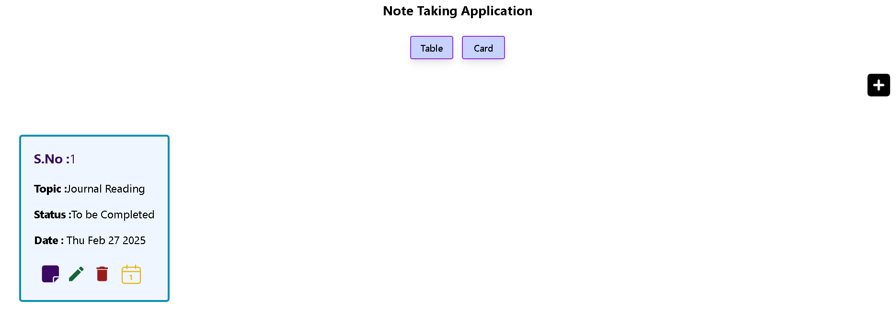
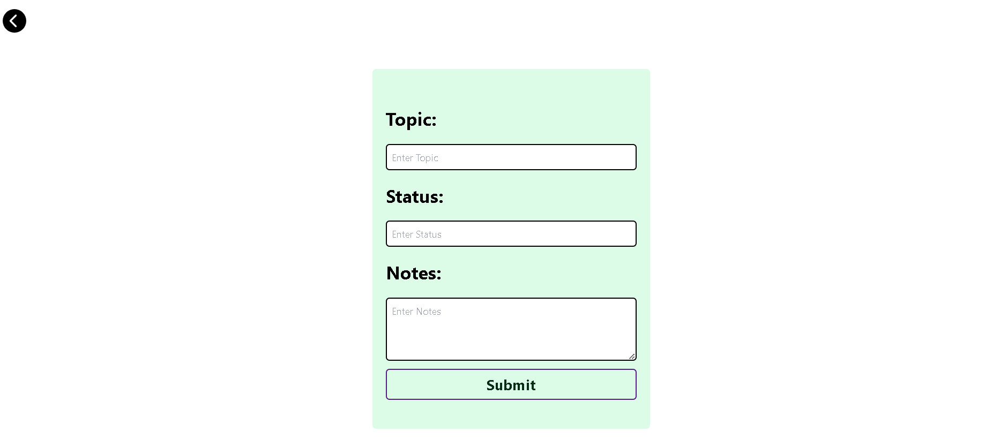
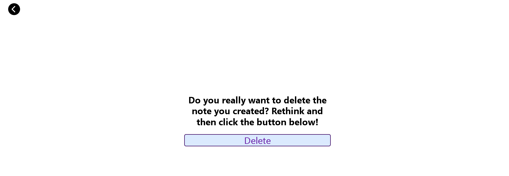

# MERN Stack Todo App

A simple and efficient Todo Application built with the **MERN** stack (MongoDB, Express, React, Node.js). This app allows users to add, update, delete, and update status of todo. It features a clean, intuitive UI and integrates with a backend API to store todo items in a MongoDB database.

## Features

- Add new todo items
- Mark todo items as completed
- Edit and update existing tasks
- Delete todo items
- Persistent data storage using MongoDB

## Technologies Used

- **MongoDB**: NoSQL database to store todo items.
- **Express.js**: Web framework for building the REST API.
- **React.js**: Frontend framework to build the interactive UI.
- **Node.js**: JavaScript runtime environment for the backend.
- **Mongoose**: ODM (Object Data Modeling) library for MongoDB and Node.js.

## Setup and Installation

### 1. Clone the Repository

git clone https://github.com/your-username/mern-todo-app.git

### 2. Start Frontend

cd frontend 
npm install && npm start

### 3. Start Backend

cd Backend
**Add your MongoDB URI** in server.js file
npm install && node server.js

## Screenshot

### Dashdoard

### CreateTodo

### Delete Todo
